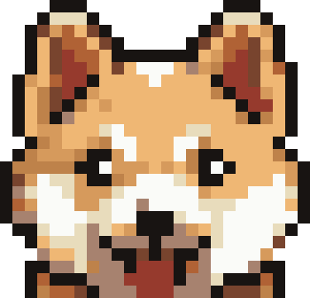
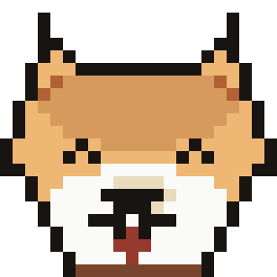
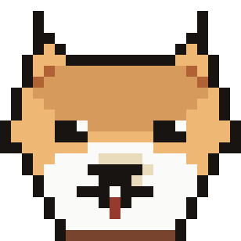
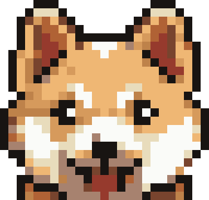
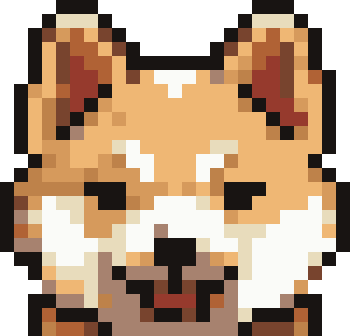
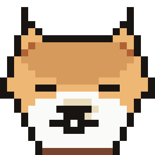
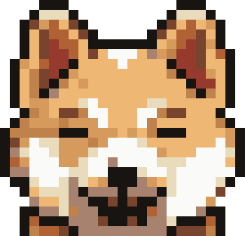
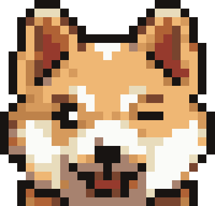

# 🐕 shiba-pet

A pixel-art shiba inu that keeps you company inside [Claude Code](https://claude.ai/code).

He is not static ASCII art. Hunger, energy and mood decay in real time; bond
and XP grow when you look after him; levels unlock tricks. He shows up in your
status line, reacts to your commits, deploys and test runs, and now and then
reminds you to review the diff before pushing.

<table>
<tr>
<td width="210" align="center">

</td>
<td>
<pre>╭──────────────────────────────────────────────────────────╮
│ Mochi  lv1 Shiba Junior  excited                         │
│ 🍖 belly    █████████░  90    ⚡ energy   ███████░░░  72 │
│ ♥ mood     ██████████ 100    ♡ bond     ████░░░░░░  45   │
│ xp 26/70   streak 1d   0 days together                   │
╰──────────────────────────────────────────────────────────╯</pre>
</td>
</tr>
</table>

That muzzle is the sprite itself, one PNG per expression. The status line draws
the same pixels in true colour with half blocks — see [Where the colour
works](#where-the-colour-works).

## Install

Requires **Python 3** and nothing else. No dependencies, no network calls.

```bash
git clone https://github.com/diveno/shiba-pet.git
cd shiba-pet
./install.sh --lang en          # or --lang it
```

That gives you the `shiba` command and (if you say yes) the status line. For
the automatic reactions, install it as a plugin from inside Claude Code:

```
/plugin marketplace add diveno/shiba-pet
/plugin install shiba
```

The plugin brings the skill (so you can just say "feed the dog") and the hooks
that react to your commands. The installer handles the two things a plugin
cannot: the `shiba` command and the status line.

Already have a status line? Keep it — the wrapper chains it:

```bash
export SHIBA_STATUSLINE_BASE="npx -y ccstatusline@latest"
```

## Commands

```
shiba                  how he's doing
shiba feed             full meal          shiba treat      snack
shiba pet              mood + bond        shiba play       costs energy
shiba walk             biggest gain       shiba nap 30     rest 3x faster
shiba wake             wake him up        shiba tricks     what he knows
shiba trick sit        perform one        shiba name Kuro  rename
shiba photo            colour PNG         shiba help       the full list
shiba style pixel|ascii|doge
```

Add `--oneline` for a single line, `--art` to draw the muzzle as text.

The command is `shiba`, not the dog's name: `shiba name Kuro` renames him and
everything else keeps working. (Before 1.1.0 the command was `mochi`; the old
shim keeps working, `install.sh` will point it out.)

## Care

| Stat | Decay | How to raise it |
| --- | --- | --- |
| belly | −4/h | `feed` (+45), `treat` (+12) |
| energy | +7/h awake, **+21/h asleep** | `nap`, `feed` (+8) |
| mood | −1.2/h, faster when hungry or after a day away | `pet`, `play`, `walk` |
| bond | never decays | `pet` (+5), `walk` (+7), tricks |

A meal is refused when he is already full. `play` needs 20 energy, `walk`
needs 30 — below that he lies down. Come back after a week and you will find
him hungry and sulking; that is the point.

Levels 0→7 (Pup → Supreme Doge). Each level unlocks a trick: `sit`, `paw`,
`down`, `roll over`, `stay`, `find the bug`, `terraform plan`.

What he feels shows on his face:

<table>
<tr>
<td align="center"><br><sub>happy</sub></td>
<td align="center"><br><sub>excited</sub></td>
<td align="center"><br><sub>calm</sub></td>
<td align="center"><br><sub>hungry</sub></td>
<td align="center"><br><sub>sleepy</sub></td>
<td align="center"><br><sub>asleep</sub></td>
<td align="center"><br><sub>sad</sub></td>
<td align="center"><br><sub>suspicious</sub></td>
</tr>
</table>

## Automatic reactions

The hooks classify what you just ran and let the dog react:

| You ran | He reacts to |
| --- | --- |
| `git commit` | commit |
| `git push`, `terraform apply`, `aws ecs update-service`, `deploy*.sh` | deploy |
| `terraform plan` | apply (he holds his breath) |
| `pytest`, `jest`, `vitest`, `phpunit`, `go test`, `npm test`, `artisan test` | tests-pass / tests-fail |

The test outcome is inferred from the output, because `PostToolUse` does not
pass the exit code. Heredoc bodies are stripped and every rule is anchored to a
real command position, so writing *about* `git commit` in a file does not make
him celebrate.

Every so often (at most one every 30 minutes) he also offers a reminder —
"test the feature before calling it done", "secrets in the diff?" — and the
contextual ones win: on `main` with uncommitted files, he says that instead.

## Where the colour works

Worth knowing before you wonder why the dog looks different in different
places. Inside Claude Code:

| Channel | Colour? |
| --- | --- |
| Status line | **Yes** — the only surface that interprets ANSI |
| `!` command panel | No: escapes print literally |
| Assistant messages | No: same |
| Attached PNG | Shown as a clickable link, not inline |
| A plain terminal outside Claude Code | Yes |

So: the status line shows the muzzle in true colour (half blocks, 11 rows) for
10 seconds after each command, then collapses back to 4 rows of bars. Both are
framed on all four sides (`SHIBA_BORDER=0` drops the frame); the one-row layout
gets the sides only, since a full box would make it three rows tall. In chat
the dog is two lines of text plus a `FACE=` path pointing at a colour portrait.
`shiba photo` writes a PNG you can open.

The muzzle sits on the **left** of the status-line text: Claude Code trims
leading whitespace per row, so a right-aligned drawing loses its indent on the
rows that are pure padding and breaks in half.

## Make it your own dog

The active sprite is `skills/shiba/assets/sprite.json`: a grid of palette
indices plus one patch list per expression. Only the **muzzle** is stored
(25x24) — that is all any surface actually renders, so the rest was dead
weight.

Swap it for another one:

```bash
./tools/use-sprite.sh drawn                  # the bundled generated dog
./tools/use-sprite.sh path/to/sprite.json    # anything with the same shape
```

It validates the grid against the declared `w`/`h` and regenerates the eight
portraits. To generate one from scratch, `tools/draw-sprite.py` draws a whole
shiba from parametric shapes — the outer outline is derived (any filled pixel
next to empty becomes black), so it stays closed whatever you change:

```bash
python3 tools/draw-sprite.py preview.png     # look at it
python3 tools/draw-sprite.py skills/shiba/assets/sprite-drawn.json --emit
```

Want a corgi? Change the ears and the tail curl.

## Languages

Strings live in `skills/shiba/i18n/<lang>.json` — `en` and `it` ship with it.
Pick one with `shiba lang it` or `SHIBA_LANG=it`. To add a language, copy
`en.json` and translate the values; the keys are the contract. Mood and event
names stay in English inside the code: they address sprite patches and files.

## Environment variables

| Variable | Default | Meaning |
| --- | --- | --- |
| `SHIBA_LANG` | `en` | Language, overrides the state |
| `SHIBA_STATE` | `~/.claude/shiba/state.json` | Where the state lives |
| `SHIBA_STATUSLINE` | `bars` | `bars` (4 rows) or `line` (1 row) |
| `SHIBA_BORDER` | `1` | `0` drops the frame around the status line |
| `SHIBA_STATUSLINE_BASE` | — | Status line to print before the dog's |
| `SHIBA_FACE_SECONDS` | `10` | How long the muzzle stays up; `0` disables |
| `SHIBA_TIP_COOLDOWN` | `1800` | Seconds between reminders |
| `SHIBA_COLOR` | auto | `0` off, `1` force on |

## Licence

MIT — see [LICENSE](LICENSE). The sprite is original art generated by
`tools/draw-sprite.py` and covered by the same licence.
